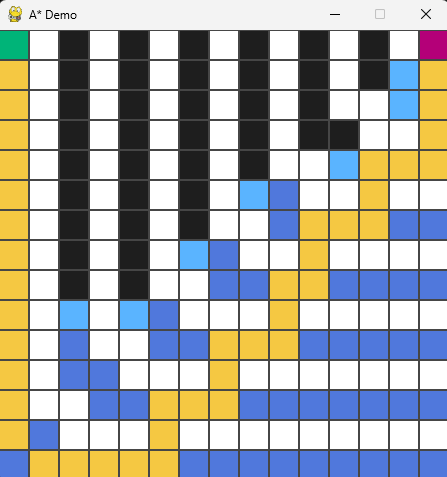

# A* Demo



## Install
```
git clone https://github.com/peterwallhead/astar-demo.git
cd astar-demo
uv sync
```

## Run
```
uv run main.py
```

## Play
Demo will run when goal location is set.

- Right click to add obstacles (and remove them again)
- Left click to add START
- Left click to add GOAL
- Press `SPACE` to rerun
- Press `r` to clear all cells

